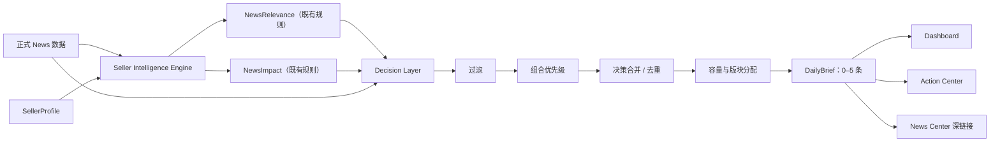

# V3 Phase 5.5 — Decision Contract + Daily Brief Model Design

状态：设计提案（Design Only）  
目标阶段：Phase 6 UI Integration 之前  
约束：本文件只定义 Seller Intelligence 与展示层之间的稳定数据契约，不修改 `NewsImpact`、`NewsRelevance`、新闻数据或现有 UI 行为。

## 1. 边界与设计原则

Decision Layer 位于 V3 Core 与 Dashboard/UI 之间。它消费 `SellerIntelligenceEngine` 的结果，负责过滤、排序、合并和压缩，最终只输出 `DailyBrief`。

核心约束：

- Dashboard 和 Action Center 不得直接读取 `News`、`NewsImpact` 或 `NewsRelevance`。
- Decision Layer 不重新计算或覆盖 `NewsImpact`、`NewsRelevance`；只组合它们已有的结论。
- `DailyBrief` 是展示层唯一的业务输入，UI 不得自行推导优先级。
- 同一条经营决策在一个 Daily Brief 中只能出现一次；不同版块通过 `DecisionItem` 或其 `id` 引用同一结论。
- 每日输出最多 5 个唯一 `DecisionItem`，允许输出 0 个。
- `opportunities` 在本阶段固定为空数组，不从新闻中自动推断商业机会。
- 所有排序与压缩必须可解释、可复现，不依赖 UI 顺序或随机数。

## 2. 数据流图



说明：图中的 `News → Decision Layer` 只用于保留标题、发布日期、官方链接和来源 ID 等事实字段，不允许 UI 绕过 `DailyBrief` 直接读取 News。

## 3. 核心接口定义

以下 TypeScript 仅为数据契约，不表示本阶段新增生产代码。

### 3.1 枚举与基础类型

```ts
type DecisionPriority = 'critical' | 'high' | 'medium' | 'low';

type DecisionCategory =
  | 'fees'
  | 'fba'
  | 'fbm'
  | 'account-health'
  | 'listing'
  | 'advertising'
  | 'brand'
  | 'compliance'
  | 'promotion'
  | 'seller-central'
  | 'developer'
  | 'general';

type MarketplaceCode =
  | 'Global' | 'US' | 'UK' | 'EU' | 'DE' | 'FR'
  | 'IT' | 'ES' | 'CA' | 'AU' | 'JP';

type RelatedModule =
  | 'profit'
  | 'profitability'
  | 'inventory'
  | 'news'
  | 'knowledge';

type BriefSection = 'actions' | 'risks' | 'monitor' | 'summary';
```

### 3.2 DecisionItem

```ts
interface DecisionItem {
  /** 稳定 ID；建议由合并后的 sourceNewsIds 生成，不使用数组下标。 */
  id: string;

  priority: DecisionPriority;
  category: DecisionCategory;
  title: string;
  explanation: string;
  whyItMatters: string;
  affectedMarketplace: MarketplaceCode[];

  /** YYYY-MM-DD；没有可靠生效日时必须为 null。 */
  deadline: string | null;

  /** 以 briefDate 为基准；未知时为 null，已过期可为负数。 */
  daysRemaining: number | null;

  /** 主跳转模块；其他受影响模块保存在 supportingModules。 */
  relatedModule: RelatedModule;
  supportingModules: RelatedModule[];

  /** 可执行、具体、单一的下一步；不可生成时为 null。 */
  recommendedAction: string | null;

  /** 当前 Item 在 Daily Brief 中的唯一归属版块。 */
  section: BriefSection;

  /** 来自 Core 的事实，Decision Layer 不得重算。 */
  impactLevel: string;
  urgency: string;
  actionRequired: boolean;
  relevance: string;

  /** 可解释性与深链接。 */
  sourceNewsIds: string[];
  sourceUrls: string[];
  mergeCount: number;
  rationaleCodes: string[];

  /** 用户处理状态由现有 NewsActionState 适配，不能改变决策优先级。 */
  userStatus: 'pending' | 'completed' | 'dismissed';
}
```

字段约束：

- `explanation` 回答“发生了什么”，不得复制长篇新闻摘要。
- `whyItMatters` 回答“为什么与当前卖家有关”，必须来自相关性与影响结论。
- `recommendedAction` 只描述一个首要动作；多步骤说明留给 News Center。
- `affectedMarketplace` 是 Seller Profile 与新闻站点的交集；Global 规则由既有相关性层解释。
- `deadline` 只使用可靠的 `effectiveAt`、合规截止日或已有影响输出，不从发布时间猜测。
- `daysRemaining` 必须由 `deadline - briefDate` 计算，不能使用客户端当前时间反复漂移。

### 3.3 DailyBrief

```ts
interface DailyBrief {
  schemaVersion: '3.0';
  briefId: string;
  briefDate: string;       // YYYY-MM-DD，按卖家时区
  generatedAt: string;     // ISO 8601
  sellerProfileId: string;
  sellerProfileVersion: string | null;

  /** 管理层一句话摘要；即使 items 为空也必须存在。 */
  summary: string;

  /** 四个数组合计的唯一 DecisionItem 不得超过 5。 */
  actions: DecisionItem[];
  risks: DecisionItem[];
  monitor: DecisionItem[];

  /** 本阶段固定 []，不得根据普通新闻自动生成机会。 */
  opportunities: [];

  /** 供“信息摘要”展示；必须是非行动、非风险、非监控项。 */
  information: DecisionItem[];

  counts: {
    inputNews: number;
    relevantNews: number;
    decisionCandidates: number;
    outputDecisions: number;
    hiddenNews: number;
    mergedNews: number;
  };

  sourceWindow: {
    from: string;
    to: string;
    timezone: string;
  };

  diagnostics: {
    truncated: boolean;
    hiddenReasonCounts: Record<string, number>;
  };
}
```

不变量：

```ts
const uniqueItems = uniqueById([
  ...brief.actions,
  ...brief.risks,
  ...brief.monitor,
  ...brief.information
]);

uniqueItems.length <= 5;
brief.counts.outputDecisions === uniqueItems.length;
brief.opportunities.length === 0;
```

## 4. Decision Layer 输入契约

为避免绑定 V3 Core 的内部实现，Decision Layer 只要求一个标准化输入视图：

```ts
interface IntelligenceDecisionInput {
  news: {
    id: string;
    title: string;
    summary: string;
    category: DecisionCategory;
    marketplaces: MarketplaceCode[];
    affectedModules: RelatedModule[];
    officialUrl: string;
    publishedAt: string | null;
    effectiveAt: string | null;
    status: 'active' | 'upcoming' | 'expired';
    actionRequired: boolean;
    actionText: string;
    actionType: string | null;
  };
  relevance: {
    level: string;
    isRelevant: boolean;
    score?: number;
    reasons: string[];
    matchedMarketplaces: MarketplaceCode[];
  };
  impact: {
    impactLevel: string;
    urgency: string;
    reasons: string[];
    deadline: string | null;
  };
}

interface BuildDailyBriefOptions {
  briefDate: string;
  timezone: string;
  maxItems?: 5;
}

interface DecisionContract {
  buildDailyBrief(
    intelligence: IntelligenceDecisionInput[],
    sellerProfile: SellerProfile,
    options: BuildDailyBriefOptions
  ): DailyBrief;
}
```

适配器只负责字段映射和枚举规范化。若 Core 未提供某个可选值，应使用 `null` 或保守默认值，不能在适配器中复制 NewsImpact 规则。

## 5. Action Prioritization 组合规则

### 5.1 原则

优先级是以下既有结论的组合：

- `impactLevel`
- `urgency`
- `actionRequired`
- `daysUntilEffective`（映射为本契约的 `daysRemaining`）
- `relevance`

Decision Layer 不改变任一输入值，只产生新的 `DecisionPriority`。

### 5.2 规范化

不同 Core 枚举必须先通过显式映射表规范化；未知值不能被当作高优先级：

```ts
impact:   critical > high > medium > low > unknown
urgency:  overdue > immediate > soon > later > none > unknown
relevance: exact > high > medium > low > irrelevant > unknown
```

`daysRemaining` 的日期档位：

- `overdue`：`< 0`
- `immediate`：`0–3`
- `soon`：`4–14`
- `later`：`15–45`
- `none`：`null` 或 `> 45`

若既有 `urgency` 与日期档位冲突，保留两者并采用更紧急档位排序，同时写入 `rationaleCodes: ['URGENCY_DATE_CONFLICT']`，不得回写 NewsImpact。

### 5.3 优先级决策表

按从上到下首次命中决定优先级：

| 优先级 | 组合条件 |
|---|---|
| Critical | relevance 至少 medium，且 impactLevel=critical，并且 actionRequired=true 或 urgency 为 overdue/immediate |
| Critical | relevance 为 exact/high，actionRequired=true，且 daysRemaining <= 3，并且 impactLevel 至少 high |
| High | relevance 至少 medium，actionRequired=true，且 impactLevel 至少 high |
| High | relevance 为 exact/high，impactLevel 至少 high，且 urgency 为 immediate/soon |
| High | relevance 为 exact/high，actionRequired=true，且 daysRemaining <= 14 |
| Medium | relevance 至少 medium，且 actionRequired=true |
| Medium | relevance 为 exact/high，impactLevel 至少 medium，或 urgency=soon |
| Low | relevance 为 low/medium/high/exact，但未命中以上规则 |

以下情况不参与优先级排序，直接过滤：

- `isRelevant=false` 或 relevance=irrelevant。
- 新闻状态为 expired，且不存在 overdue 的未完成合规行动。
- 缺少稳定新闻 ID 或官方来源链接。

同级排序键：

1. `actionRequired=true` 优先。
2. 更短的非空 `daysRemaining` 优先；负数最前。
3. 更高 `impactLevel`。
4. 更高 relevance。
5. 更高 urgency。
6. `effectiveAt` 升序，空值置后。
7. `publishedAt` 降序。
8. `news.id` 字典序，保证稳定结果。

## 6. Daily Brief 版块分配

一个 Item 只进入一个版块，按以下顺序分配：

1. `actions`：满足 Action Center 资格的可执行事项。
2. `risks`：高影响但暂时没有可靠行动，或行动尚不具备执行条件的事项。
3. `monitor`：将在 15–45 天生效、需要关注但当前无需操作的变化。
4. `information`：相关但没有行动、风险或近期时间窗口的摘要。
5. `opportunities`：本阶段固定为空。

首页对应关系：

| 首页区域 | DailyBrief 字段 |
|---|---|
| 今日行动 | `actions` |
| 风险提醒 | `risks` |
| 即将发生变化 | `monitor` |
| 信息摘要 | `information` + 顶层 `summary` |

Dashboard 仅渲染这些字段，不再次过滤，不读取 News 模块的 `getHighPriorityNews()` 或 `getLatestNews()`。

## 7. Action Center 数据契约

### 7.1 进入条件

DecisionItem 必须同时满足：

1. `actionRequired === true`。
2. relevance 至少为 medium，且 `isRelevant !== false`。
3. `recommendedAction` 是非空、具体、可执行的动作。
4. `relatedModule` 有有效路由；若只能“阅读新闻”，必须明确路由到 News Center。
5. `userStatus === 'pending'`。
6. 未被判定为无效过期；overdue 合规行动除外。
7. 满足以下任一门槛：
   - priority 为 critical/high；
   - priority=medium、daysRemaining <= 14，且 impactLevel 至少 medium；
   - priority=medium、urgency 为 overdue/immediate，且 relevance 为 exact/high。

因此，`actionRequired=true` 只是必要条件，不是充分条件。低相关、低影响、无明确下一步或远期事项不会进入 Action Center。

### 7.2 不进入 Action Center 的处理

- 高影响但没有动作：进入 `risks`。
- 远期生效：进入 `monitor`。
- 一般相关信息：进入 `information`。
- 无关或重复：隐藏，只进入 diagnostics 计数。
- 已完成：不出现在今日行动；保留完成状态供历史视图读取。

### 7.3 状态契约

V2 `NewsActionState` 可继续以稳定新闻 ID 保存完成状态。合并多个新闻后，Phase 6 应使用稳定 `DecisionItem.id` 保存状态，并同时保留 `sourceNewsIds`。迁移期读取规则：

1. 先读取 DecisionItem ID 状态。
2. 若不存在且 `sourceNewsIds` 中任一新闻已完成，则只标记“部分完成”，不能自动把合并决策设为完成。
3. 用户显式完成合并决策后，写 DecisionItem ID；不批量改写原新闻状态。

## 8. 信息压缩：38 条新闻如何变成 5 条以内

### 8.1 过滤

先排除：

- 与 Seller Profile 站点、履约方式、业务模块无关的新闻。
- 已过期且无遗留行动的新闻。
- 非正式、未审核或缺少官方链接的数据。
- 精确重复新闻。
- 已完成且当天没有状态变化的行动。

过滤只减少候选集，不删除 News Center 中的原始新闻。

### 8.2 排序

使用第 5 节的优先级及稳定同级排序，禁止按发布时间单独决定重要性。

### 8.3 合并

当以下条件全部满足时可以合并：

- 相同 `category`。
- Marketplace 交集相同或一个是另一个的父区域。
- 相同主 `relatedModule`。
- 相同或可归纳为同一 `recommendedAction`。
- 生效时间窗口相差不超过 14 天，或都没有截止日。

合并后的规则：

- 优先级取组内最高值。
- deadline 取最早可靠日期。
- affectedMarketplace 取并集。
- `sourceNewsIds`、`sourceUrls` 取去重并集。
- title 描述共同经营决策，不拼接全部新闻标题。
- explanation 最多概括共同变化；News Center 保留所有原文详情。
- 不允许跨 actionRequired 与纯信息项合并，以免制造虚假行动。

### 8.4 容量分配

默认容量为 5 个唯一决策：

1. Critical 不受版块配额限制，先占位。
2. 剩余位置优先保证最多 2 个 `actions`。
3. 尽量保留 1 个 `risks`。
4. 尽量保留 1 个 `monitor`。
5. 有空位时加入 1 个 `information`。
6. 如果 Critical/High 已占满 5 条，不为低优先级版块强行腾位。

### 8.5 隐藏

超过容量的项目不进入 Dashboard，但必须：

- 仍可在 News Center 查看。
- 计入 `hiddenNews`。
- 按原因计入 `hiddenReasonCounts`，例如 `LOWER_PRIORITY`、`DUPLICATE`、`MERGED`、`IRRELEVANT`、`EXPIRED`。
- 当 `truncated=true` 时，UI 可显示“还有 N 条相关动态”，但不能暗示这些都是待办。

## 9. 示例 JSON

```json
{
  "schemaVersion": "3.0",
  "briefId": "brief-seller-cn-2026-09-20",
  "briefDate": "2026-09-20",
  "generatedAt": "2026-09-20T08:00:00+08:00",
  "sellerProfileId": "seller-cn-001",
  "sellerProfileVersion": "3.0",
  "summary": "今日有 2 项需要处理、1 项风险需要关注，另有 1 项政策将在两周内生效。",
  "actions": [
    {
      "id": "decision-ca-fba-prep-202609",
      "priority": "critical",
      "category": "fba",
      "title": "检查加拿大站 FBA 预处理与贴标流程",
      "explanation": "加拿大站相关入库要求即将生效，现有货件流程可能需要调整。",
      "whyItMatters": "卖家档案包含 CA 站点且使用 FBA，未调整可能影响入库接收。",
      "affectedMarketplace": ["CA"],
      "deadline": "2026-09-22",
      "daysRemaining": 2,
      "relatedModule": "inventory",
      "supportingModules": ["news"],
      "recommendedAction": "今天复核 CA 站货件的 prepOwner、labelOwner 和供应商贴标流程。",
      "section": "actions",
      "impactLevel": "high",
      "urgency": "immediate",
      "actionRequired": true,
      "relevance": "exact",
      "sourceNewsIds": ["amazon-ca-fba-prep-2026"],
      "sourceUrls": ["https://sellercentral.amazon.com/example"],
      "mergeCount": 1,
      "rationaleCodes": ["MARKETPLACE_MATCH", "FBA_MATCH", "DEADLINE_3_DAYS"],
      "userStatus": "pending"
    }
  ],
  "risks": [
    {
      "id": "decision-eu-vat-reporting-202609",
      "priority": "high",
      "category": "compliance",
      "title": "复核欧盟 VAT 报告数据口径",
      "explanation": "VAT 报告字段与货件层级税额处理发生变化。",
      "whyItMatters": "卖家档案包含 EU 站点，利润测算和税务报告可能出现口径差异。",
      "affectedMarketplace": ["EU"],
      "deadline": null,
      "daysRemaining": null,
      "relatedModule": "profit",
      "supportingModules": ["news"],
      "recommendedAction": null,
      "section": "risks",
      "impactLevel": "high",
      "urgency": "soon",
      "actionRequired": false,
      "relevance": "high",
      "sourceNewsIds": ["amazon-eu-vat-report-update"],
      "sourceUrls": ["https://developer-docs.amazon.com/example"],
      "mergeCount": 1,
      "rationaleCodes": ["EU_MATCH", "PROFIT_MODEL_IMPACT", "NO_SAFE_ACTION"],
      "userStatus": "pending"
    }
  ],
  "monitor": [
    {
      "id": "decision-us-title-policy-202610",
      "priority": "medium",
      "category": "listing",
      "title": "两周内关注美国站商品标题规则",
      "explanation": "新的标题规范将在两周内进入生效窗口。",
      "whyItMatters": "美国站 Listing 可能需要审核，但当前尚未进入立即处理窗口。",
      "affectedMarketplace": ["US"],
      "deadline": "2026-10-04",
      "daysRemaining": 14,
      "relatedModule": "news",
      "supportingModules": [],
      "recommendedAction": "在生效前检查受影响 Listing 的标题长度。",
      "section": "monitor",
      "impactLevel": "medium",
      "urgency": "soon",
      "actionRequired": true,
      "relevance": "medium",
      "sourceNewsIds": ["amazon-us-title-policy"],
      "sourceUrls": ["https://sell.amazon.com/example"],
      "mergeCount": 1,
      "rationaleCodes": ["US_MATCH", "UPCOMING_14_DAYS"],
      "userStatus": "pending"
    }
  ],
  "opportunities": [],
  "information": [
    {
      "id": "decision-seller-university-202609",
      "priority": "low",
      "category": "general",
      "title": "Seller University 新增公开学习内容",
      "explanation": "Amazon 更新了公开培训资源。",
      "whyItMatters": "可作为团队培训资料，但不影响当前经营流程。",
      "affectedMarketplace": ["Global"],
      "deadline": null,
      "daysRemaining": null,
      "relatedModule": "knowledge",
      "supportingModules": ["news"],
      "recommendedAction": null,
      "section": "summary",
      "impactLevel": "low",
      "urgency": "none",
      "actionRequired": false,
      "relevance": "medium",
      "sourceNewsIds": ["amazon-seller-university-public"],
      "sourceUrls": ["https://sell.amazon.com/example-learning"],
      "mergeCount": 1,
      "rationaleCodes": ["GENERAL_SELLER_INFO"],
      "userStatus": "pending"
    }
  ],
  "counts": {
    "inputNews": 38,
    "relevantNews": 14,
    "decisionCandidates": 8,
    "outputDecisions": 4,
    "hiddenNews": 24,
    "mergedNews": 4
  },
  "sourceWindow": {
    "from": "2026-08-21",
    "to": "2026-09-20",
    "timezone": "Asia/Shanghai"
  },
  "diagnostics": {
    "truncated": true,
    "hiddenReasonCounts": {
      "IRRELEVANT": 18,
      "EXPIRED": 2,
      "MERGED": 4
    }
  }
}
```

示例 URL 仅表达字段格式；实现与测试不得依赖这些占位 URL。

## 10. Dashboard 数据契约

Phase 6 后 Dashboard 的依赖应从：

```text
NewsModule + NewsActionState → DashboardIntelligence
```

过渡为：

```text
DailyBrief + DecisionActionState → DashboardDecisionView
```

Dashboard 的职责仅限：

- 展示 DailyBrief 的四个版块。
- 将 `priority` 映射为视觉层级。
- 使用 `relatedModule` 生成主跳转。
- 使用 `sourceNewsIds` 生成 News Center 深链接。
- 提交完成/恢复状态事件。

Dashboard 禁止：

- 根据 `importance` 或 `actionRequired` 二次排序。
- 重新计算 relevance、impact、urgency、deadline。
- 从 NewsModule 补齐缺失的 Daily Brief 内容。
- 把隐藏新闻解释为待办。

## 11. 兼容性检查

### 11.1 V2 Dashboard Intelligence

现状：`dashboard-intelligence.js#getModel()` 直接调用 `NewsModule.getHighPriorityNews()`、`getLatestNews()`，并自行筛选 actionRequired。

兼容策略：

- Phase 6 新增适配入口接收 `DailyBrief`，不要立即删除 V2 入口。
- 迁移期可将 `DailyBrief.actions` 映射为 V2 `pending`，将 `risks + monitor + information` 映射为摘要卡片。
- V2 的 highPriority/latest 只作为回退模式，不能与 DailyBrief 同屏混排。
- 当 DailyBrief 可用时，它必须成为唯一数据源。

### 11.2 V2 Action Center

现状：V2 将所有 `actionRequired === true` 的正式新闻作为 Action Center 候选。

兼容策略：

- V3 只将 `DailyBrief.actions` 交给 Action Center。
- 继续复用现有完成/恢复交互和路由配置。
- 使用 DecisionItem ID 作为新状态键，同时保留 sourceNewsIds 供迁移和追踪。
- 已完成状态不参与优先级计算，只影响展示集合。

### 11.3 News Center

News Center 继续作为完整事实库：

- 不删除、不压缩正式 News。
- 接收 `sourceNewsIds` 深链接并定位原新闻。
- Daily Brief 的合并决策可展开到多个来源。
- 候选新闻仍不能进入 Decision Layer；只有正式、已发布 News 可以参与。

结论：该契约与 V2 三个模块兼容，但需要适配层；不建议让 V2 Dashboard 直接理解 NewsImpact/NewsRelevance，否则会再次形成 UI 与 Core 的强耦合。

## 12. 错误与降级契约

- Seller Profile 缺失：返回有效的空 DailyBrief，summary 提示需要完善档案；不得退化为“展示全部新闻”。
- Intelligence 输入为空：返回 0 项 DailyBrief，不报 UI 异常。
- 单条 impact/relevance 缺失：该条进入隐藏诊断，原因 `INCOMPLETE_INTELLIGENCE`。
- 日期无效：deadline/daysRemaining 设为 null，写入 `INVALID_DEADLINE`，不得猜测日期。
- relatedModule 无效：回退到 `news`，写入 `UNKNOWN_MODULE_FALLBACK`。
- 超过 5 条：确定性截断并记录 diagnostics。

## 13. Phase 6 UI Integration 开发顺序

1. **冻结契约与枚举映射**：根据实际 V3 Core 导出值确认 `impactLevel`、`urgency`、`relevance` 映射表，形成契约测试。
2. **实现纯 Decision Builder**：只实现 `buildDailyBrief()`、优先级、合并、容量和诊断；不接 UI。
3. **建立固定 fixtures**：覆盖 0、1、5、超过 5 条，日期边界、合并、无关新闻、缺失字段和 Action Center 门槛。
4. **接入 SellerIntelligenceEngine**：新增薄适配器，不修改 NewsImpact 和 NewsRelevance 规则。
5. **实现状态迁移适配**：兼容 V2 `NewsActionState`，明确 DecisionItem ID 与 sourceNewsIds 的关系。
6. **Dashboard 只读接入**：先替换数据源，不改视觉；四个版块只读 DailyBrief。
7. **Action Center 接入**：仅渲染 `DailyBrief.actions`，验证不再出现“所有 actionRequired 都进入”的问题。
8. **News Center 深链接**：支持单个或多个 `sourceNewsIds` 定位和回看。
9. **回退与空状态**：验证 Profile 缺失、Core 异常、无相关决策、输入不完整。
10. **端到端回归**：确认 V2 页面、正式 News、候选审核、利润/库存/广告模块均不受影响。
11. **最后再做 UI 强化**：仅在数据契约稳定后增加优先级视觉、版块折叠和“更多相关动态”入口。

## 14. Phase 6 验收标准

- Dashboard 与 Action Center 的运行时代码不直接读取 NewsImpact/NewsRelevance。
- 同一输入与 briefDate 必须产生字节级稳定的排序结果。
- 每个 DailyBrief 只有 0–5 个唯一决策。
- opportunities 始终为空。
- `actionRequired=true` 但低相关/无明确动作的新闻不进入 Action Center。
- 所有展示结论均能追溯至至少一个 sourceNewsId 和官方 URL。
- NewsImpact、NewsRelevance 既有测试结果保持不变。
- V2 完成/恢复状态在迁移期不丢失。

## 15. 当前基线审查说明

撰写本契约时，当前工作区与 GitHub `main` 未包含以下已声明的 V3 Core 文件：

- `seller-profile.js`
- `news-relevance.js`
- `news-impact.js`
- `seller-intelligence-engine.js`

因此本文将它们视为上游既有能力，并通过 `IntelligenceDecisionInput` 隔离具体实现。Phase 6 开始前必须用实际导出接口完成第 13 节第 1 步的枚举对照；在此之前，不应把文档中的规范化枚举误认为上游文件的真实字段值。
